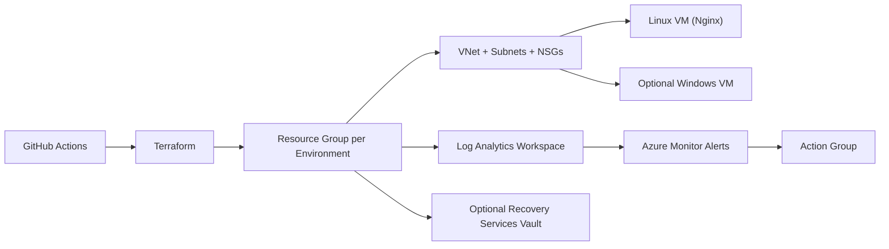

# Azure VM Operations Platform

Azure operations portfolio project for Junior/Mid Cloud Support roles: Terraform-managed VM infrastructure, OIDC-secured GitHub Actions change flow, baseline Azure Monitor alerting, governance/RBAC controls, and incident/restore operational evidence.

## Proof Status

**Implemented**
- Environment-separated Terraform (`environments/dev`, `environments/staging`, `environments/prod`)
- OIDC CI/CD with plan/apply separation and checksum verification
- Monitoring baseline (Log Analytics, diagnostics, VM availability/CPU/disk alerts)
- Governance/RBAC modules (policy assignments + scoped role assignments)
- Incident runbooks and response workflow docs

**Partial**
- Restore evidence pack maturity (structure is strong; some exports are still placeholder/sanitized)
- Synthetic monitoring scenarios (implemented in Terraform but conditional/optional by environment inputs)

**Planned/Documented**
- KPI automation (MTTD/MTTA/MTTR calculation pipeline)
- Workbook-as-code provisioning
- Advanced anomaly/security detection alert rules

## What Is Implemented

- Terraform module composition in `modules/platform/main.tf`
- Reusable modules for network, Linux/Windows VM, monitoring, backup baseline, governance, RBAC
- GitHub Actions workflows in `.github/workflows/terraform-dev.yml`, `.github/workflows/terraform-staging.yml`, `.github/workflows/terraform-prod.yml`
- Operational runbooks in `runbooks/`
- Claim-to-implementation traceability matrix in `docs/handbook/claims-to-implementation.md`

## Implementation Status Labels

Use these labels consistently across docs and evidence:
- **Implemented**: provisioned/enforced in Terraform or workflow code and verifiable in repo
- **Partial**: implemented but optional/conditional or not fully rolled out in all environments
- **Simulated/Sanitized**: operationally realistic artifact, but redacted or sample-shaped for public sharing
- **Planned**: documented improvement not yet implemented

## Architecture Overview



## Key Operational Capabilities

- Safe infra change path: checks -> plan -> checksum -> approval -> apply approved plan
- Incident triage flow using runbooks + KQL packs + evidence chain
- Restore-drill workflow with validation and trend reporting
- Policy and RBAC controls aligned to support operations scope

## Reviewer Quick Links

- `REVIEWER-QUICKSTART.md`
- `docs/handbook/claims-to-implementation.md`
- `docs/INTERVIEW-5MIN-VERIFY.md`
- `runbooks/`
- `evidence/`
- `.github/workflows/`
- `modules/`

## Repository Structure

```text
.
├── .github/workflows/     # Terraform pipelines (dev/staging/prod)
├── environments/          # Terraform root modules per environment
├── modules/               # Reusable Terraform modules
├── docs/                  # Handbook, operations notes, reviewer docs
├── runbooks/              # Incident and recovery runbooks
├── evidence/              # Alerts, policy, incidents, restore drills, live artifacts
└── operations/            # Trend and operations review outputs
```

## Technical Stack

- Terraform + AzureRM/AzureAD providers
- GitHub Actions + Azure OIDC (`azure/login@v2`)
- Azure Monitor + Log Analytics + Action Groups
- Azure Policy + Azure RBAC
- Recovery Services Vault backup baseline

## Important Honesty Notes

- This is a VM-centric support/operations project, not a large multi-team platform.
- Some evidence artifacts are intentionally **Simulated/Sanitized** and explicitly labeled.
- Unsupported or partial claims are tracked in `docs/handbook/claims-to-implementation.md`.
- CI/CD does not enforce external repo settings (branch protection/environment reviewer config); those are required controls documented in `docs/terraform-github-actions.md`.

## Interview / Reviewer Docs

- `REVIEWER-QUICKSTART.md`
- `docs/INTERVIEW-5MIN-VERIFY.md`
- `docs/handbook/incidents.md`
- `docs/handbook/incident-evidence-template.md`
- `docs/handbook/restore-drill-process.md`

## Detailed Docs

- CI/CD deep dive: `docs/terraform-github-actions.md`
- Architecture and handbook index: `docs/handbook/README.md`
- KQL triage pack: `docs/operations/kql-triage-query-pack.md`
