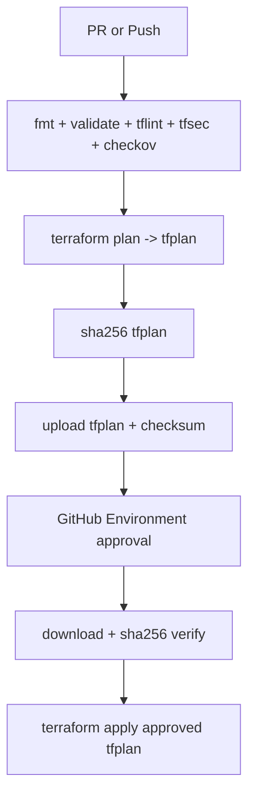

# Azure VM Operations Platform (Terraform + Evidence-Driven Incident Response)

This is a **portfolio-grade Azure infrastructure operations** repository focused on Terraform delivery safety, incident handling, and recovery drills for a small VM-based platform.

This README is intentionally conservative: **no inflated claims**. Anything not implemented is labeled explicitly.

---

## Executive Summary (What this is solving)

Small platform teams often struggle with:

- inconsistent infrastructure changes across environments
- unclear incident evidence trails (“what happened and what changed?”)
- backup setups that are configured but not operationally proven

This repo shows a realistic way to run Azure infrastructure with:

- **Terraform** (environment-separated)
- **GitHub Actions** (OIDC + approvals + plan integrity checks)
- **Azure Monitor + Log Analytics** (baseline alerts + investigation queries)
- **Runbooks and evidence packs** (incidents + restore drills)

---

## Implemented vs Partially Implemented vs Planned

### Implemented (verified in code)

- **Terraform environment separation**: `environments/dev`, `environments/staging`, `environments/prod`
- **Reusable Terraform modules**: network, VMs, monitoring baseline, backup baseline, governance, RBAC
- **CI/CD safety controls**:
  - OIDC login (`azure/login@v2`)
  - fmt/validate + **tflint/tfsec/checkov** gates
  - plan artifact + **SHA-256 checksum verification before apply**
  - manual apply with GitHub Environments approvals
  - apply restricted to `main` for all envs; extra confirmation for prod
- **Monitoring baseline (Terraform)**:
  - Log Analytics Workspace + diagnostic settings
  - metric alerts: VM availability, high CPU, low disk
  - action group (email receiver support)
- **Backup baseline (Terraform)**:
  - Recovery Services Vault (optional)
  - daily VM backup policy + protection binding (optional)
- **Operational evidence frameworks**:
  - incident evidence template + sample package
  - restore drill process + monthly drill evidence folder
  - KQL triage query pack for support workflows
  - strict claim-to-implementation traceability matrix

### Partially implemented (exists in code, but rollout is optional/conditional)

- **Service-level synthetic checks / endpoint availability alerting**
  - Terraform resources are implemented in `modules/monitoring/main.tf` (`azurerm_application_insights`, web test, availability alert, latency query alert)
  - rollout is conditional (`enable_synthetic_availability` + endpoint URL input) and not forced on by default in all environments
- **Security log alerting (auth burst)**
  - analysis queries and evidence references exist, but alert rules/ingestion paths are not provisioned here
- **Dashboards/workbooks**
  - discussed in docs, not provisioned as Terraform resources

### Planned (explicit roadmap)

- Replace simulated evidence packs with **real sanitized exports** from a live tenant
- Add drift-detection scheduling and operations review automation
- Improve host security baseline (patching/Defender) without changing platform scope

Single source of truth for this honesty check:

- `docs/handbook/claims-to-implementation.md`

---

## Architecture Overview (VM-based on purpose)

The platform is intentionally VM-centric (fits cloud support / operations role expectations and avoids Kubernetes complexity).

- VNet with management/application/monitoring subnets
- Linux VM running Nginx via cloud-init
- optional Windows management VM
- Log Analytics + Azure Monitor alerts
- optional Recovery Services Vault for backup
- optional Azure Policy governance and RBAC assignments

```mermaid
flowchart LR
  GH[GitHub Actions] --> TF[Terraform]
  TF --> RG[Resource Group per Environment]
  RG --> VNET[VNet + Subnets + NSGs]
  VNET --> LINUX[Linux VM (Nginx)]
  VNET --> WIN[Optional Windows VM]
  RG --> LAW[Log Analytics Workspace]
  LAW --> ALERTS[Metric Alerts]
  ALERTS --> AG[Action Group]
  RG --> RSV[Optional Recovery Services Vault]
```

Key code entry points:

- Composition: `modules/platform/main.tf`
- Environments: `environments/*/main.tf`

---

## Operational Workflows (How this is run)

### CI/CD workflow (plan integrity + approvals)



Workflows:

- `.github/workflows/terraform-dev.yml`
- `.github/workflows/terraform-staging.yml`
- `.github/workflows/terraform-prod.yml`

Deep dive:

- `docs/terraform-github-actions.md`

### Incident response flow (evidence-first)

```mermaid
flowchart LR
  DETECT[Detect alert/signal] --> ACK[Acknowledge + assign]
  ACK --> TRIAGE[Triage: network/compute/app/dependency]
  TRIAGE --> MITIGATE[Mitigate (prefer CI/CD change path)]
  MITIGATE --> VALIDATE[Validate recovery + watch window]
  VALIDATE --> POST[Postmortem + corrective actions + evidence pack]
```

Evidence template:

- `docs/handbook/incident-evidence-template.md`

Sample incident evidence package:

- `evidence/incidents/sample-incident/`

### Recovery / restore drill flow (prove backups are usable)

- Process: `docs/handbook/restore-drill-process.md`
- Monthly drill evidence: `evidence/restore-drills/2026-05-monthly-drill/`
- Trend report: `operations/restore-trend.md`

---

## Governance and Security (What is actually enforced)

### Enforced via Terraform (when enabled)

- **Azure Policy** (custom definitions + assignments at environment scope):
  - required tags
  - allowed VM sizes
  - optional deny public IP
- **RBAC**:
  - pipeline principal Contributor scoped to RG (and other scoped roles)
  - VM admin login roles at VM scope
  - Monitoring Reader at Log Analytics scope

Code:

- `modules/governance/*`
- `modules/rbac/*`

### CI/CD identity security

- OIDC-based GitHub Actions auth (no static cloud credential in workflow code)
- Runbook for drift/failure:
  - `runbooks/oidc-authentication-failure.md`

---

## Monitoring and Investigation (Support-ready)

Implemented alerting (Terraform):

- `alert-vm-availability` (Sev1-style host availability)
- `alert-vm-high-cpu` (Sev2)
- `alert-vm-low-disk-space` (Sev2)
- Optional synthetic service checks (when enabled):
  - `alert-service-availability-endpoint`
  - `alert-service-synthetic-latency-high`

Investigation query pack (copy/paste KQL):

- `docs/operations/kql-triage-query-pack.md`

Monitoring operations notes:

- `monitoring.md`

---

## Known Limitations (explicit)

- Synthetic endpoint monitoring is provisioned in Terraform but remains optional and must be explicitly enabled/configured per environment.
- Some evidence packs are **simulated/sanitized** (explicitly labeled) until replaced by real exports.
- VM workload is intentionally minimal (Nginx baseline) to focus on operations controls, not application engineering.
- No automated “metrics pipeline” yet for MTTD/MTTA/MTTR computation from exports (process exists; automation is planned).

---

## How to Defend This Project in Interviews

### The core story (60 seconds)

“I built a small Azure VM-based platform to demonstrate operational engineering: safe Terraform delivery with OIDC and plan integrity, enforceable governance via Azure Policy, actionable baseline monitoring, and repeatable incident + restore drill evidence packs. I also document what is and isn’t implemented so a reviewer can verify quickly.”

### The 3 walkthroughs that should always work

1. **Safe change flow**: show plan gating, checksum verification, and approvals.
2. **Incident reconstruction**: show `evidence/incident-index.md` + one incident postmortem chain.
3. **Restore drill proof**: show `operations/restore-trend.md` + the monthly drill evidence folder.

### Where reviewers will probe (and how to answer)

- “Is this actually implemented or just docs?”
  - Open `docs/handbook/claims-to-implementation.md` and follow the matrix.
- “What happens when Terraform apply fails halfway?”
  - Use `runbooks/terraform-partial-apply-recovery.md`.
- “What breaks OIDC and how do you recover without weakening security?”
  - Use `runbooks/oidc-authentication-failure.md`.

---

## Repository Map (where to look)

```text
.
├── .github/workflows/              # Terraform pipelines (dev/staging/prod)
├── environments/                   # Terraform roots
├── modules/                        # Terraform modules
├── docs/handbook/                  # Architecture, ops, governance, incidents, traceability
├── docs/operations/                # Query packs, control improvement history
├── runbooks/                       # On-call runbooks
├── evidence/                       # Incident evidence + restore drill evidence + exports
└── operations-reviews/             # Monthly ops review documents
```

---

## Recommended Screenshots / Diagrams (for GitHub + interviews)

Keep this list small; each item must prove something operational.

- **GitHub Actions**:
  - plan approval gate + environment approvals
  - plan artifact + checksum verification step output
- **Azure Monitor**:
  - alert fired view (one Sev1 and one Sev2)
  - alert history export (small date range)
- **Log Analytics**:
  - Heartbeat query output for an incident window
  - CPU trend query output for a CPU incident window
- **Azure Policy**:
  - compliance view showing an enforced deny control (real export preferred)
- **Recovery Services Vault**:
  - restore job status + timestamps
  - post-restore validation (service check + heartbeat resumption)

---

## Suggested GitHub Project Description

Azure Terraform operations portfolio: environment-separated IaC, OIDC-secured CI/CD with plan integrity, enforceable governance, baseline monitoring, incident evidence packs, and restore drill validation.

## Suggested GitHub Topics

`azure` `terraform` `github-actions` `oidc` `azure-monitor` `log-analytics` `incident-response` `runbooks` `reliability-engineering` `infrastructure-as-code`
