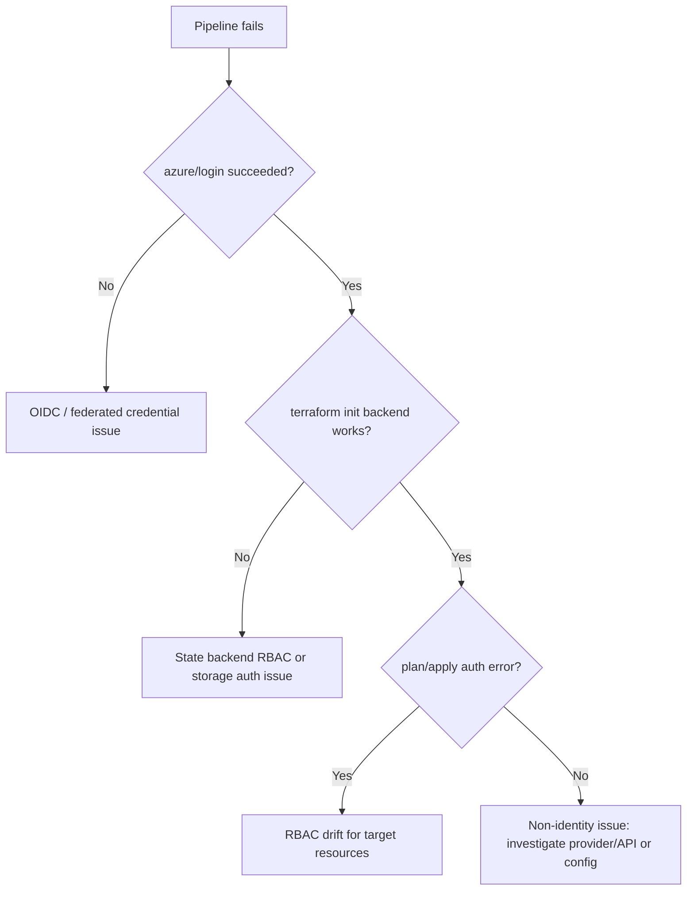

# Runbook: OIDC Authentication Failure / Permission Drift (GitHub Actions -> Azure)

This runbook covers failures where GitHub Actions cannot authenticate to Azure via OIDC, or authenticates successfully but fails due to RBAC drift / insufficient permissions.

Scope:
- Terraform pipelines using `azure/login@v2` + `ARM_USE_OIDC=true`
- Azure federated credentials on an Entra ID application (service principal)
- RBAC at subscription/resource-group level for Terraform execution and state backend access

Security posture:
- OIDC is preferred because it avoids long-lived secrets.
- When OIDC fails, do **not** “fix” by switching to a static client secret as a shortcut.

---

## Symptoms

Typical symptoms in GitHub Actions:
- `azure/login@v2` step fails with auth errors
- `terraform init` fails to access the remote backend (storage auth)
- `terraform plan/apply` fails with `AuthorizationFailed` or `insufficient privileges`
- intermittent failures: some runs succeed, others fail (usually due to claim mismatch or policy changes)

Operational impact:
- blocked infrastructure changes (including incident hotfixes)
- delayed recovery actions
- potential temptation to bypass security controls (avoid this)

---

## GitHub Actions failure patterns (what you see in logs)

### Pattern A: OIDC token exchange / federated credential mismatch
Examples:
```text
Error: AADSTS70021: No matching federated identity record found for presented assertion.
Error: Failed to obtain access token for Azure.
```

### Pattern B: Azure login succeeded but backend access denied
Examples:
```text
Error: Error building ARM Config: Error acquiring the state lock
... AuthorizationFailed ... Microsoft.Storage/storageAccounts/blobServices/containers ...
```

### Pattern C: Plan/apply fails due to RBAC drift
Examples:
```text
AuthorizationFailed: The client '<object-id>' with object id '<object-id>' does not have authorization to perform action ...
```

### Pattern D: Wrong tenant/subscription context
Examples:
```text
The subscription '<id>' could not be found.
The tenant '<id>' is not authorized to access subscription '<id>'.
```

---

## Quick triage decision tree



---

## Azure federated credential issues (OIDC trust failures)

### What commonly breaks
- Federated credential subject does not match the workflow identity:
  - repo name changed
  - branch or environment changed
  - workflow moved or renamed if subject conditions are strict
- Wrong `AZURE_CLIENT_ID` configured in GitHub variables
- Entra application deleted/recreated (new object/app IDs)

### Investigation steps

1) Confirm which workflow is failing and from which ref:
- `terraform-prod.yml` apply requires `workflow_dispatch` and `refs/heads/main`
- `terraform-dev/staging` apply now also requires `refs/heads/main`

2) Confirm the pipeline identity configuration:
- GitHub repo variables:
  - `AZURE_CLIENT_ID`
  - `AZURE_TENANT_ID`
  - `AZURE_SUBSCRIPTION_ID`

3) Validate Entra app/service principal exists and is correct:

```bash
# Verify the app registration exists
az ad app show --id "<AZURE_CLIENT_ID>" --query "{appId:appId,displayName:displayName}" -o json

# Verify service principal exists
az ad sp show --id "<AZURE_CLIENT_ID>" --query "{id:id,appId:appId,displayName:displayName}" -o json
```

4) Validate federated credentials exist and match expected subject/issuer/audience:

```bash
# Federated credential list for the app registration
az rest --method GET \
  --url "https://graph.microsoft.com/beta/applications/$(az ad app show --id "<AZURE_CLIENT_ID>" --query id -o tsv)/federatedIdentityCredentials" \
  --query "value[].{name:name,issuer:issuer,subject:subject,audiences:audiences}" \
  -o json
```

What to look for:
- **issuer** should match GitHub OIDC issuer (commonly `https://token.actions.githubusercontent.com`)
- **audiences** should include `api://AzureADTokenExchange`
- **subject** must match what your workflow actually presents (repo + ref + environment depending on how it was configured)

Security implications:
- A too-broad federated subject increases the blast radius if the repo is compromised.
- A too-narrow subject causes frequent breakage on ref/environment changes.

---

## Token validation checks (what you can safely validate)

You cannot “print” OIDC tokens in logs safely. Do not log raw tokens.

Safe checks:
- confirm job has `permissions: id-token: write`
- confirm `azure/login@v2` is using OIDC (not a client secret)
- confirm the workflow uses the expected tenant/subscription IDs

From workflow files:
- `.github/workflows/terraform-*.yml`
- look for:
  - `permissions: id-token: write`
  - `ARM_USE_OIDC: "true"`

---

## RBAC drift investigation (Azure permissions failures)

### Identify what is failing
RBAC failures usually include:
- principal object id
- scope and action

Example:
```text
AuthorizationFailed: The client '<object-id>' with object id '<object-id>' does not have authorization to perform action 'Microsoft.Resources/subscriptions/resourceGroups/read' over scope ...
```

### Confirm assignments for the pipeline principal

1) Find the service principal object ID:
```bash
az ad sp show --id "<AZURE_CLIENT_ID>" --query id -o tsv
```

2) List role assignments at the expected scope (resource group / subscription):
```bash
az role assignment list \
  --assignee "<sp-object-id>" \
  --all \
  --query "[].{role:roleDefinitionName,scope:scope}" \
  -o table
```

3) Verify backend state access roles (Storage Account / container):
- common roles needed:
  - `Storage Blob Data Contributor` (data-plane) OR an equivalent least-privilege role
  - plus management-plane roles if provisioning storage resources (not recommended in the same stack)

### Investigate drift cause
Common drift sources:
- role assignment removed manually
- scope moved (resource group recreated)
- service principal rotated/recreated
- policy changes restricting role assignments

Security implications:
- Fixing RBAC by granting `Owner` or subscription-wide `Contributor` is high risk.
- Always prefer **resource group scope** and minimum required data-plane access for state.

---

## Least privilege review (what “good” looks like here)

For this repo’s Terraform execution model:
- Pipeline identity:
  - `Contributor` at **resource group scope** for environment RG(s)
  - Storage roles scoped to the **tfstate storage account/container**
- Human operators:
  - read-only + just-enough “VM admin login” roles where needed

Reference:
- `modules/rbac/main.tf` and the object IDs provided in environment variables.

---

## Rollback procedures (when identity changes break prod)

Goal: restore pipeline ability without loosening security.

Rollback options (ordered by preference):
1. **Revert the change that caused identity failure**
   - Example: restore the deleted federated credential or role assignment to its prior state.
2. **Restore to last known-good identity config**
   - If the service principal was recreated: revert to prior app/SP if still available (often not).
3. **Temporary break-glass access (time-boxed)**
   - Only if production recovery is blocked and approved by duty manager.
   - Must be time-boxed and reversed immediately after recovery.

What NOT to do:
- do not add static `client_secret` to GitHub secrets as a quick fix
- do not grant subscription-wide Owner “just to get it working”

---

## Validation workflow (after fix)

1) Re-run **plan** job first (non-mutating):
- confirm:
  - azure/login succeeds
  - `terraform init` against remote backend succeeds
  - plan completes

2) For applies (manual only):
- ensure environment approvals are in place
- ensure apply is from `main`

3) Validate expected role assignments remain least-privilege:
- re-run role assignment list query and confirm no emergency roles remain

---

## Escalation paths

Escalate to incident commander when:
- prod hotfix apply is blocked and customer impact is ongoing

Escalate to identity/security owner when:
- federated credential configuration is missing or unexpectedly broadened
- role assignments require exception approval

Escalate to duty manager when:
- break-glass access is requested

---

## Post-incident actions

Required follow-ups:
- Document:
  - what changed (federated credential / RBAC assignment)
  - why it changed
  - how it was detected
  - how long deployment was blocked
- Add guardrails:
  - an explicit “OIDC health check” runbook step before high-risk deploy windows
  - periodic RBAC drift review for pipeline identities
- Update this repo’s evidence framework:
  - include OIDC/RBAC failure evidence in incident evidence packages when it blocks recovery.

